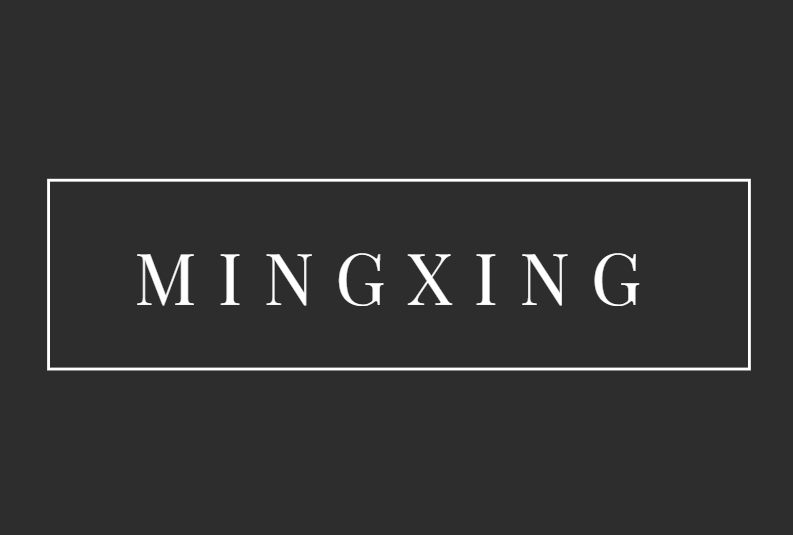
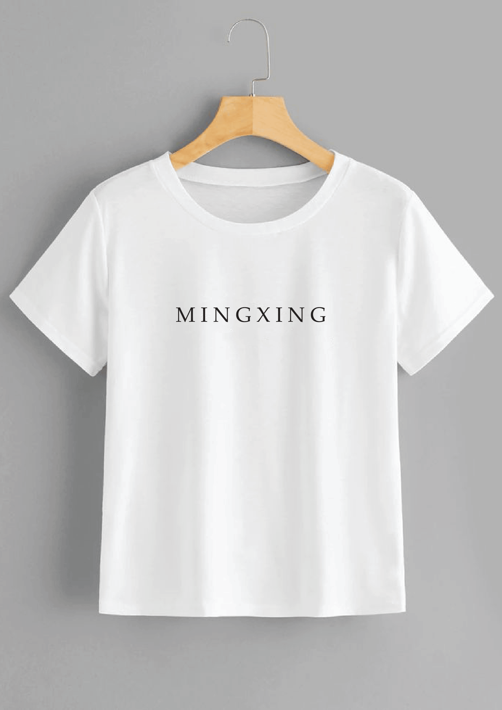
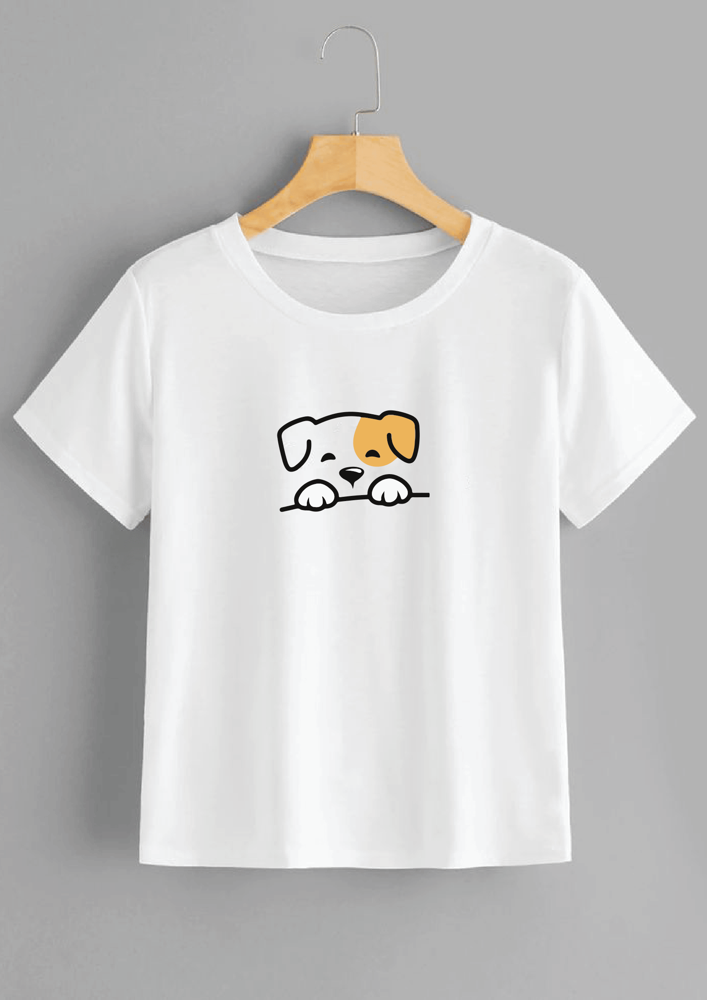

# Mingxing Premium

<table>
  <tr>
    <td width="200" style="vertical-align: top;"></td>
    <td style="vertical-align: top;"><strong>A bespoke lifestyle e-commerce experience specializing in premium apparel and curated merchandise.</strong></td>
  </tr>
</table>

---

## Overview

Mingxing is a high-aesthetic digital platform designed for the modern connoisseur. It combines editorial-inspired design with a seamless shopping experience, focusing on visual excellence and technical precision. The platform serves as a showcase for exclusive collections, featuring fluid animations and a minimalist interface that emphasizes the craftsmanship of every product.

<div align="center">
  <table>
    <tr>
      <td></td>
      <td></td>
    </tr>
  </table>
</div>

## The Collection

Discover our signature pieces, where quality meets minimalist design. Each item is crafted to tell a story of simplicity and elegance.

<div align="center">
  <table>
    <tr>
      <td align="center"><br />Selection I</td>
      <td align="center"><br />Selection II</td>
    </tr>
    <tr>
      <td align="center"><br />Selection III</td>
      <td align="center"><br />Selection IV</td>
    </tr>
  </table>
</div>

## Technical Foundation

The platform is built on a robust, modern stack designed for high performance and scalability.

### Frontend
- Framework: React 19
- Build Tool: Vite 7
- Styling: Tailwind CSS 4
- Animations: GSAP with React Integration
- Navigation: React Router 7

### Backend
- Framework: Spring Boot 3.2.x (Java 17)
- Messaging: Spring Mail for automated inquiry handling
- API Architecture: Full RESTful implementation

## Core Features

- Editorial-Style Navigation: A fluid, visually-driven navigation experience.
- Dynamic Cart System: A lightweight, responsive side-drawer for managing selections.
- Bespoke Inquiry Service: Integrated contact system for personalized order handling.
- Aesthetic Visuals: High-resolution product showcase with interactive hover states and scroll-triggered reveals.
- Fully Responsive: Precision-engineered layouts that adapt seamlessly to all device resolutions.

## Development Setup

### Project Structure

```text
Mingxing-Premium/
├── src/                # Frontend application source
├── backend/            # Spring Boot service layer
├── public/             # Static public resources
└── vite.config.js      # Application configuration
```

### Installation

1. Frontend Implementation:
   ```bash
   npm install
   npm run dev
   ```

2. Backend Implementation:
   ```bash
   cd backend
   .\mvnw.cmd spring-boot:run
   ```

---

*Curated by Mingxing Collection*
